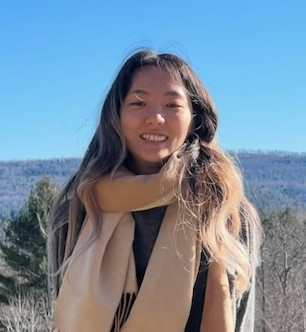

  
# Belinda Liang  
Brooklyn, New York  
Aspiring Interaction Designer  
**Connect with me:**[🤝LinkedIn](https://www.linkedin.com/in/belinda-liang/)[🎨Portfolio](https://belindaliang.wixsite.com/portfolio)[📄Resume](https://drive.google.com/file/d/17-q97peSxNUfclC494CPBH53E4M2mArf/view?usp=sharing)  

Hello, my name is **Belinda Liang**. I graduated from Hunter College in May 2020 with a **B.A. in Media Studies** and a **minor in Computer Science**. I currently work at a non-profit afterschool program and provide guidance for high school students to help them achieve their goals. I am looking to combine my passion for **education and tech**  - **my goal is to design interactive experiences that are fun and engaging!**
